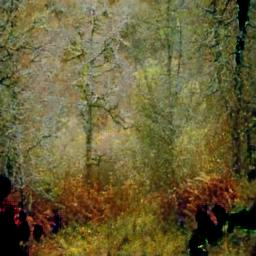
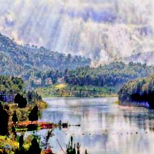

# Exploring-U-GAT-IT
# I'm Something of a Painter Myself - U-GAT-IT Implementation

This repository contains the implementation of the **U-GAT-IT** model for the Kaggle competition *I'm Something of a Painter Myself*. The goal is to create Monet-style images using generative adversarial networks (GANs) and submit them for evaluation based on MiFID.

## Overview
“Every artist dips his brush in his own soul, and paints his own nature into his pictures.”  
— Henry Ward Beecher

This competition challenges participants to mimic the unique styles of artists like Monet using GANs. By combining science and art, participants generate convincing Monet-style images that trick classifiers into believing they are authentic Monet artworks.

The competition requires generating **7,000 to 10,000 Monet-style images** with dimensions **256x256x3 (RGB)** and evaluates submissions based on the **MiFID** metric (Memorization-informed Fréchet Inception Distance).

For more details, visit the [Kaggle competition page](https://www.kaggle.com/competitions/gan-getting-started).

## Features
- Implementation of **U-GAT-IT**, a state-of-the-art GAN model for image-to-image translation.
- Dataset preparation and visualization.
- Training and evaluation scripts tailored for generating Monet-style images.
- Submission preparation ensuring compliance with Kaggle's requirements.

## Introduction
U-GAT-IT is a robust model for image-to-image translation. This project leverages U-GAT-IT to generate Monet-style images for the Kaggle competition.

The GAN model consists of:
1. **Generator**: Creates Monet-style images.
2. **Discriminator**: Classifies real vs. generated images, providing feedback to the generator.

## Competition Details
- **Submission Format**: Generate 7,000–10,000 images, zip them, and name the file `images.zip`.
- **Image Size**: 256x256x3 (RGB).
- **Evaluation Metric**: MiFID, which combines Fréchet Inception Distance (FID) and memorization metrics.
- **Honor Code**: Submissions must be created using generative methods and not by directly altering Monet images.

## Evaluation
Submissions are evaluated on the **MiFID** metric, which incorporates:

1. **FID (Fréchet Inception Distance)**: Measures the similarity between the real and generated image distributions.
2. **Memorization Distance**: Penalizes overly similar images to the training data, ensuring diversity and originality in the generated images.

## Sample Generated Images

Here are two examples of Monet-style images generated by the model:

  
  

## Acknowledgments
- The Kaggle competition organizers for this creative challenge.
- The authors of [U-GAT-IT](https://arxiv.org/abs/1907.10830).
- Kaggle for providing the platform and community to explore and learn.

